# Mobile Network Architecture

Author: **LBO** 🥖

Sources :

- [Course on Moodle](https://moodle.insa-lyon.fr/course/view.php?id=1993)
- [Mines Telecom course](https://lms.fun-mooc.fr/c4x/MinesTelecom/04001/asset/Support-Mooc-Semaine1A3__1_.pdf?fbclid=IwAR2x-M8uEiKbeXyirlpQQDEDMzVylUqdneQte3tpE1WyZVt-BP0nQjwl5vw)

# Sending a SMS though the mobile network

Because mobile networks are no fun without stories, let's start a new one.

## User Domain

Your name's Alicia and you possess a mobile phone. 
Here, your mobile phone will be referred to as a *mobile station* (**MS**) or more globally, a *user equipment* (**UE**). 
In your phone, there's a **SIM** (*Subscriber Identify Module*) card.

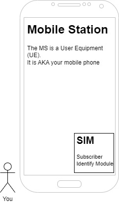

> uSIM and eSIM stands for *universal SIM* and *electronic SIM* and are just newer versions of the good old SIM.

There's also a fancy name for your phone number : the *mobile station international subscriber directory number*, a.k.a the **MSISDN** 🤯.

There are a whole lot of identifiers but we'll talk about that later ([here](#theres-more-to-say-about-identifiers)).

Now, let's send a **SMS** (*Short Media Service*). 
If you want to achieve this, you should be close to an antenna. 
Here, the antennas will are referred as **BTS** for *Base Transceiver Station*.

You're entering the **RAN**, the *Radio Access Network* !

## RAN : Radio Access Network

> But what's a *Base Station* ?

A base station is usually composed of two elements : the BTS (the antenna) and a **BSC** (*Base Station Controller*). 
It will be the entrypoint for your SMS. The SMS will be received by the BTS and treated by the BSC.

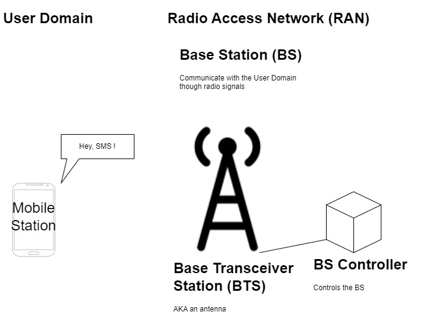

The roles of the BSC are :
- to control the base station,
- to concentrate the traffic (multiple BTS can be connected to a single BSC),
- to define the radio resource allocation algorithm

For 3G, the BTS is a **NodeB** and the BSC is a **RNC**, *Radio Network Controller*.

For 4G / LTE, the BTS and BSC are a unique device called a **eNodeB**.
For 5G, this device is called a **gNodeB**.

> Let's dive even deeper on eNodeB and gNodeB.
> 
> They're usually split in two devices : the **RRH**, *Remote radio Head* (the new name for the antenna) and the **BBU**, *Base Band Unit*.
>
> The BBU can be placed at a certain distance from the RRH, so that it can find its place in a small datacenter or a PoP (Point of Presence) where it can easily be managed.
> But in fact, the BBU is usually placed next to its RRH, under the sun and the snow where it can die the fastest 😐.

Now, what happens ? Your SMS was correctly received by the BTS that sent it to its BSC which makes your SMS go from the RAN to the **CN**, the *Core Network* !

### Territory division

I'm sorry to interrupt the little story but there's one thing to say here. 
But if you're impatient to read the rest of the story, move on and come back later.
That part of the course will be referred to later, so feel free to skip it now.
No worries :)

As mentioned in the title, the territory is divided into different areas.
Please note that these areas are transparent to any user.
Still, they're important for their equipments.

You will later learn in the course that your operator needs to know your location to communicate with you. 
If a RAN covers a certain part of the territory, the division is not made here.
In fact, the territory is divided into **location areas** which are covered by multiple RAN.

> The zone covered by a RAN is called a **cell**.

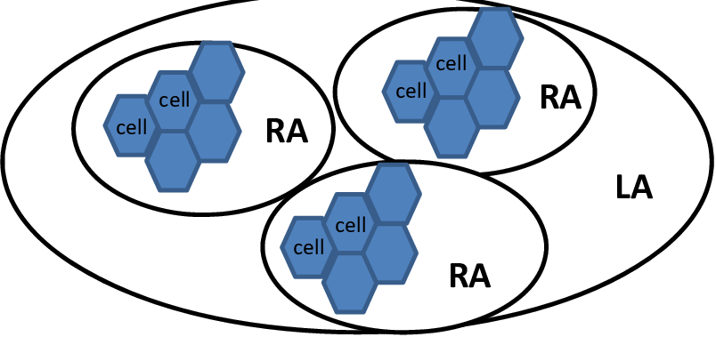

*Source image on [researchgate](https://www.researchgate.net/figure/Mobile-network-hierarchy-Location-Area-LA_fig4_276037211).*

> The **RA** you see on the image above are the *Routing Areas*.
> They are not important to note here, but they do exist.

A user can freely move inside its location area with having special nothing to do.
But if it leaves its current location area, it should give notice to the operator (to the CN you'll see in the next section).

If you didn't skip that part, I'm sorry for the interruption.
Let's continue the story.

## CN : Core Network

> What's the entrypoint of the CN ?

The BSC is connected to a **MSC**, a *Mobile Switching Center* which is basically a big switch that receives multiple packets from multiple BSC.
A most common name is *service gateway*. 
The MSC was the device used in 2G. In 3G, this device was a **SGSN**, a *Serving GPRS Support Node*.

In 4G, this device was a **S-GW**, i.e. a *Serving GateWay* and in 5G, it was an **UPF**, i.e. an *User Plane Function*.

After receiving a packet, it transmits it to the CN big boss : the **CNC**, the *Core Network Controller* 🤴.

In 4G, the CNC was a **MME** (*Mobility Management Entity*). 
In 5G, this device was an **AMF** (*Access and Mobility Management Function*). 

> Note that the CNC only exists since the 4G. 
> Before that, its functions were handled by the service gateway and the out gateway, which we'll talk about later. 

The CNC is a very expensive device 💸💸. There are few CNC over the country and they process every single packet of the mobile network.

The CNC has a very important role and is connected to multiple databases and routers to do its job.

- User DB : Registers the operator subscribers.
- Facturation DB : Register the charges of each subscriber.
- Location DB : **HLR** (*Home Location Registry*) in 2/3G and **HSS** (*Home Subscriber Server*) in 4/5G.

> There's more to say about the *Location DB*.
>
> This database stores an approximate location of every users of the network.
> This location is used to send the packets to the correct base station.
> 
> Plus, the location DB is in fact hidden behind an **AuC** (Authentication Server).
> This server waits for an **IMSI** (*International Mobile Subscriber Identity*) and starts a challenge with the user. 
> The Auc sends a **RAND** (RANDom) which a random vector corresponding to the challenge. 
> The MS (Mobile Station) answers with a **SRES** (*Signed RESponse*). 
> If the response is the correct response for the given challenge, the AuC returns its information from the Location DB.

The CNC can now sends your SMS to the *out gateway*, which is basically a router. 
In 2G, this device was a **gMSC** (*gateway Mobile Switching Center*) and in 3G, it was a **GGSN** (*Gateway GPRS Support Node*). 
They provided the CNC function. 
In 4G, this device becomes a **P-GW** (*Packet Data Network Gateway*). 
In 5G, it's an UPF, the same as the service gateway.

> For IPv4, the out gateway provides NAT functions.

This router is connected to a DHCP server. 
That's where an IP address can be given to your mobile station (your phone).
But for the simple SMS you sent, there's no need.

> We've seen three different devices for different generations with a lot of acronyms. 
> Let's make a quick recap.

| Common name                   | Description                                                                            | 2G                                     | 3G                               | 4G                                            | 5G                               |
| ----------------------------- | -------------------------------------------------------------------------------------- | -------------------------------------- | -------------------------------- | --------------------------------------------- | -------------------------------- |
| Service gateway               | Router on the RAN side, connected to a lot of base stations                            | Mobile Switching Center (MSC)          | Serving GPRS Support Node (SGSN) | Serving Gateway (S-GW)                        | User Plane Function (UPF)        |
| Core Network Controller (CNC) | Connected to multiple DB, process every incoming packets in the Core Network           | Does not exist                         | Does not exist                   | Mobility Management Entity (MME)  | Access and Mobility Management Function (AMF) |
| Out gateway                   | Gateway to other operators. Connected to a DHCP server and have NAT functions for IPv4 | Gateway Mobile Switching Center (gMSC) | Gateway GPRS Support Node (GGSN) | Packet Data Network Gateway (P-GW)            | User Plane Function (UPF)        |

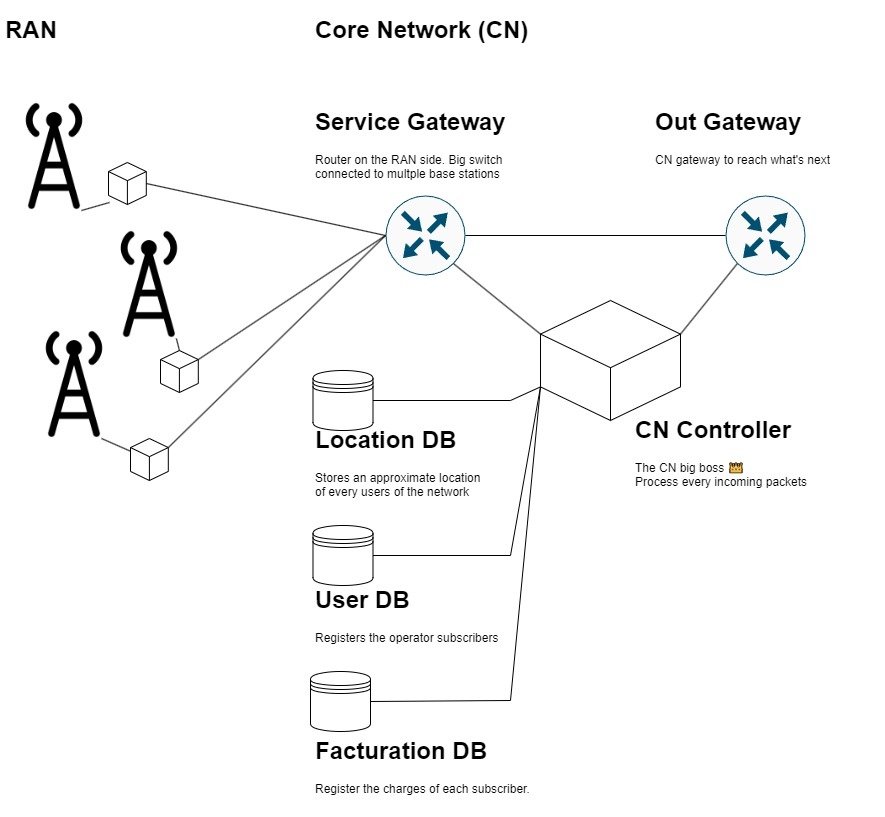

> **Wait**, should your SMS really get out by the out gateway ?
> Why the CNC sent your SMS to the out gateway ?
>
> It did because you're sending an SMS to someone who have a different operator. 
> Otherwise, It would have been sent back by the CNC to the service gateway and to the corresponding base station.

Ok, so where does the out gateway sends your precious SMS ?

It is sent to the operator of your recipient.
To be more precise, it's sent to the out gateway of its operator, then to the CNC and then to a base station that will notify your recipient.
To say that in simple terms, it follows the same path but in reverse, in the recipient's operator network.

> The circle is complete ✔️.

## A bit more details about SMS

What if the recipient has his phone off ?

There exists a SMS center, connected to the out gateway which holds your SMS for a certain amount of time which depends on the country laws.

Two protocols are in play : **CP** (*Connection Protocol*) and **RP** (*Relay Protocol*).

# Service network, beyond the SMS

Your SMS went though a lot of devices before reaching your recipient. 
But for you, it was only few seconds before your friend received it.

But now, you don't want to send SMS anymore. 
You want to use different services proposed by your operator.

> Wait, what services ?

*"Services"* is a vast term and refers to many possible services. 
One of them is basically Internet 🌐 (that you should know about) but it can be the fixe-lined telephony (where advertisers used to call you), **VoIP** (*Voice over IP*) or the **IMS** (*IP Multimedia Subsystem*).

> The IMS are services that operator tried to propose to replace some app such as social network, drives, games, etc.
> Still, they couldn't compete against the already existing apps and almost no IMS are left on the market.

To reach these services, your packets still follow the same path as previously for your SMS, but the out gateway sends your packet elsewhere, to the corresponding service.

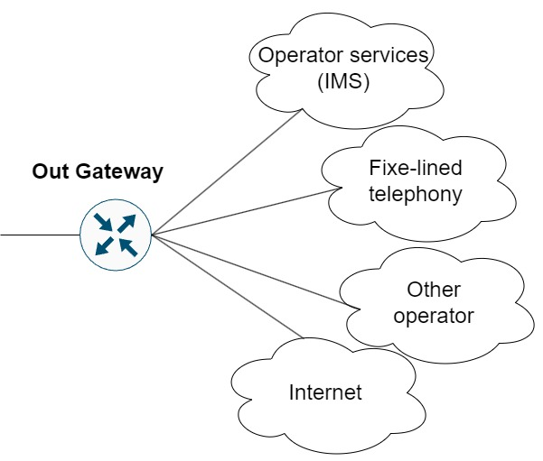

# There's more to say about identifiers

Do you remember what I said previously ?

> There are a whole lot of identifiers but we'll talk about that later (here).

Here is there. 
Now is the time we talk about these identifiers.

Let's start simple with the **MSISDN** (*Mobile Station International Subscriber Directory Number*). 
It is your phone number basically.
But how is it built ?

**MSISDN = CC (+ NDC) + SN**

- **CC** is the *Country Code*. It identifies ... the country (ex: 33 for France).
- **NDC** is the *National Destination Code*. It identifies a specific country area. This was useful for the fixed-line telephony since the phone stayed pretty static. For mobile phones, this identifiers is not used anymore but is rather replaced by an identifier identifying the operator.
- **SN** is the *Serial Number*, to differentiate different phone that could have the same previous identifiers.

So the MSISDN if useful for an operator to find its user but is not enough to identify a user or an equipment.

To identify a user, we use the **IMSI** (*International Mobile Subscriber Identity*). 
It identifies a subscriber though its SIM card.

To identify an equipment, we use the **IMEI** (*International Mobile Equipment Identity*). 
An IMEI can be blocked by an operator for stolen equipments.

The **TMSI** (*Temporary Mobile Subscriber Identity*) is, *as its name tell*, temporary. 
It can last few hours and starts when a connection starts. 
It is unique per operator. 
The following property allows to create a new unique identifier : the **GUTI** (*Globally Unique Temporary Identity*) which is given by the AMF (the 5G Core Network Controller).

An other type of identifier exist : the **RNTI** (*Radio Network Temporary Identifier*) is a unique identifier for an antenna to identify a cell. Note that there can be multiple types of RNTI that have different functions.

> Wait, what's a cell of an antenna ?
>
> The response is in the [next section](#resource-block).

# Connection to the RAN

Multiple users can be connected to a base station. 
The ultimate goal is to avoid, most as possible, the collisions between the users (check *CA, collision avoidance*).

## Resource block

The solution used to deal with these multiple users is to assign a **resource block** to each of them.

> Ok, what's that ?

The antenna defines a time-frequency grid : 

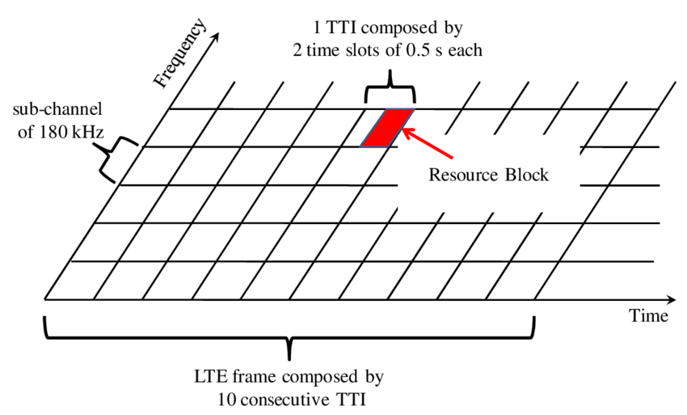

*Source image on [researchgate](https://www.researchgate.net/figure/Time-Frequency-radio-resources-grid_fig3_233731550)*.

When a resource block is assigned to a user, he's only allowed to emit its packets on the given time and frequency slots he was assigned.

This process reduces the collisions between the users since they emit on different time and frequencies.

## Up-link and down-link

The resources repartition is a bit more complex than a simple grid. 
In fact, there's two grids to consider : the **UL** (*Up-Link*) and **DL** (*Down-Link*).

The UL is transmitted by the UE to the RAN.

The DL is transmitted by the RAN to the UE. 
This grid contains specific channels such as the **DTCH** (*Dedicated Traffic Channel*) and the **DCCH** (*Dedicated Control Channel*) that we'll talk about later ([here](#rrc-connected))

## Random access

There exists specific resources blocks to handle certain functions, such as the *random access*.
The random access channel is called by any incoming user on the RAN.

> Note that the random access channel is the one where any incoming user writes.
> The risk of collision is high, but in life, you only get what you deserve.
>
> More seriously, the collisions happens rarely since the chosen preamble should be orthogonal with each others.

When a new user connects to an antenna, it sends a random access preamble containing a random number. 
The RAN answers with a **RAR** (*Random Access Response*).

> The RAR contains :
> - the index of the random access preamble it answers,
> - the resource blocks assigned to the user,
> - a RNTI (see [identifiers](#theres-more-to-say-about-identifiers))
>
> \- from [sciencedirect.com](https://www.sciencedirect.com/topics/computer-science/random-access-response) (simplified)

## RRC : Radio Resource Control

Let's talk about the RRC layer. 

This protocol defines two states :
- RRC idle
- RRC connected

> Trivial.

As you guessed, the RRC protocol, is a **connected** protocol, meaning that it handles a connection between a client and a server.

The connection starts after a user received a RAR (see previous section).
The user sends back a *RRC CONNECT* packet to initiate a connection, to which the RAN answers with a *RRC CONNECTION SETUP*, to which the user answers with a *RRC CONNECTION SETUP COMPLETE*, to which the RAN answers with a *CONTENTION RESOLUTION*.

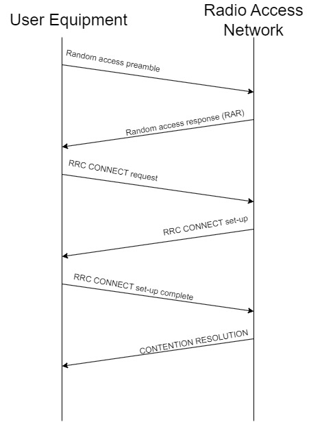

After the CONTENTION RESOLUTION, the UE knows wether it's now connected to the RAN or not.
If it's connected, it goes to the state *RRC CONNECTED*.
Otherwise, it starts the whole process again.

### RRC IDLE

In the RRC IDLE state, no uplink is sent.
That is easy to understand since no connection is up.

Therefore, there's a downlink to consider on two specific channels : the **broadcast** and the **paging** channels.

The broadcast channel is mainly used for sharing information about an antenna.
It could also be used for different purposes such as sending an SMS to every users connected to an antenna.
Still, this is actually not used, at least in France, where "broadcast" messages are sent individually to each network user -_-

The paging channel is used to locate the user at any point of time, wether he's connected or not.
This is very useful is you want to be joined when no connection is on-going. There's two types of data sent on this channel : the **beacons** and the **serving call** (whenever someone tries to reach a UE, see [call control](#cc--call-control)).

### RRC CONNECTED

Being in the RRC CONNECTED state means that the connection has been successfully completed.
It means that you might be calling someone (maybe your friend Nicole) or that you're scrolling social network on your 4/5G package.

> The connections holds while data waits in the up-link or down-link buffer.
> When no data is to be sent, an **inactivity timer** starts. 
> When the timer gets to zero, the RRC disconnect and the MS returns to the state RRC IDLE.

#### UPLINK trafic

Now, an uplink is to consider on two channels **DTCH** (*Dedicated Traffic Channel*) and **DCCH** (*Dedicated Control Channel*).

The DTCH is the channel where all your data goes though.

On the other side, the DCCH is the channel where controls traffic goes though.
It gives information about the buffer state (on the RAN side), the channel quality (of the downlink seen by the UE) and the quality of the other channels on the neighbor cells (see the [territory division section](#territory-division)).
With this information, the BSC knows how much blocks are required for the data it need to transmit and can adapt the modulation.

> When the channel quality is low, the BSC changes the modulation with more redundancy.

> Even though the UE detects that it would have a better quality with its neighbor, it is no decision of it to change its connection.
> The RAN is the only entity that can make that kind of choice.
> The UE only acts as an information reporter and waits for instructions.

#### DOWNLINK traffic

On the DL, we observe the same two channels :

- The DTCH is still the channel where all your data goes though.
- The DCCH channel gives information about the channel, such as the modulation to use, the power, the resources blocks and so on. It a called a **scheduling**.

Such as it was in the RRC IDLE state, the DL also contains the broadcast channel for the same purposes (see [RRC IDLE](#rrc-idle)).
The difference lies within the paging channel.
There's no more use for it since the user is connected.
The Location DB contains the correct location of the user and it won't be a problem to reach him.

But, we might have a problem if the user starts to move, right ?

Right ! That's the subject of the [next section](#keep-moving).

But first, I need to apologize because I might have simplified thing. 
In fact, a full connection requires being in the state RRC CONNECTED (to be be connected to the RAN) and in the state EMM ATTACH (to be connected to the CN).

> Time to read about [(E)MM](#emm--enhanced-mobility-management).

But first, just a quick overview of **PDCP**.

## PDCP : Packet Data Convergence Protocol

The PDCP allows an IP packet to be transformed into a new format.

It compresses the IP header to reduce the traffic on the channel.

# Connection to the CN

## (E)MM : (Enhanced) Mobility Management

The EMM protocol, such as RRC is a connected protocol.
It is the layer just above RRC, same level as IP or the Voice protocol.
This layer and all the ones above defines the **non-access stratum** while the belows layers are the **access stratum**.

The above layers can be **SMS** (*Short Media Service*), **SM** (*Session Management*), **SS** (*Supplementary Source*) or [**CC** (*Call Control*)](#cc--call-control).

It defines two states :
- EMM DETACH (disconnected from the CN)
- EMM ATTACH (connected to the CN)

Hence, we have to deal with two connected layers : see [RRC X (E)MM](#rrc-x-emm).

Let's take a look at what happens during a connection :

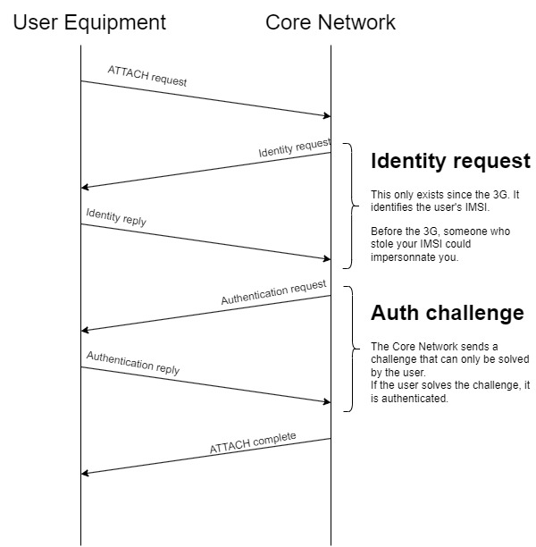

> Have you read the note about the identity request ?
> This attack still exists today and is performed thanks to an IMSI catcher.
> 
> First, the attacker jams the network to keep only the 2G on.
> When your UE tries to connect, it sends its IMSI which is caught by the IMSI catcher.
> With your IMSI, the attacker can now impersonate you and sends spam SMS to all your contacts (and more).
>
> When you receive spam SMS, don't insult the sender.
> He's probably just a victim of an IMSI catcher.
> It often happens in large cities where the attackers drives with their IMSI catcher, jamming the network in their area to retrieve some IMSI.
>
> The solution would be to entirely revoke the 2G network but only time will make that possible.

## RRC x (E)MM

Here, we have two protocols, each defining two states.
That leads to four possible states.
And because a hundred words couldn't explain best than a scheme, here's what we have :

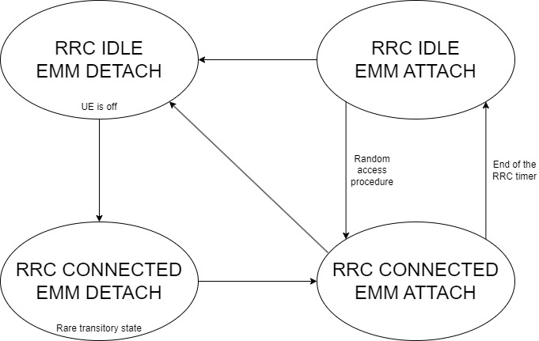

## Summary

That was a lot so let's gather all of that into a quick summary.

The RRC protocol allows a connection between the user domain and the RAN.

The EMM protocol allows a connection between the user domain and the CN and requires the RRC CONNECTED state. It can be replaced by IP for certain services, or by the Voice protocol.

Here's what the protocol stack looks like :

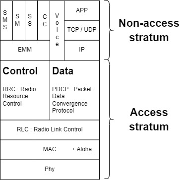

> The **RLC** (*Radio Link Protocol*) is mainly used to fragmentate the messages.

# CC : Call Control

> This section is the continuation of the [RRC IDLE section](#rrc-idle).

Let's illustrate the use of the paging channel with a new little story.

Your **BFF** (*Best Friend Forever*), Nicole, is calling you while you walk in the street with your phone in your bag.
Its starts to ring on Nicole's phone but your phone is still silent.

Pause the time and let's observe what's happening while you're still unaware of that phone call. 
The Nicole's UE sent the information of that phone call to its operator CN though the RAN she's connected to. 
That information is received to your operator CN which knows where you are thanks to its Location DB. 
Once it found you in its register, it sends the information to the correct RAN which writes this information into its paging channel (here it comes).
You're the target of the call. Hence, your UE starts a new connection has seen earlier to go to the state RRC CONNECTED state.

It's only now that your phone starts to ring.
So even if you're very fast to answer, Nicole still waited few seconds during your phone went from RRC IDLE to RRC CONNECTED.

> Two things to note here :
>
> If you were using your phone, the connection would already have been set-up.
> Thus, Nicole would have waited less.
>
> Moreover, it's possible that your CN didn't not know exactly where you were at that moment in time.
> The things he knows for sure, is your location area, which is covered by multiple RAN.
> If if would have been the case, the call would have been sent to every RAN in your location area (see the [territory division section](#territory-division)).

Let's detail a bit.
It's time to talk about **CC** (*Call Control*).

This protocol is used to establish a connection between a calling user (here, Nicole) and a called user (you, Alicia).

Once again, a scheme is better than a hundred words :

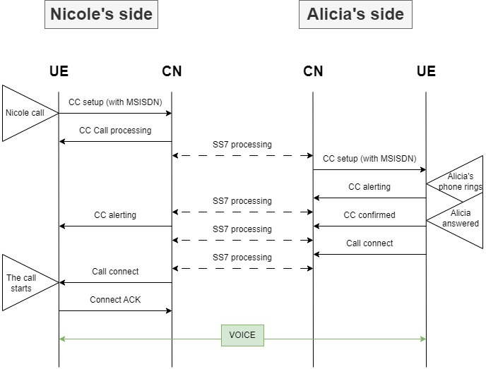

The Nicole's CN make all the necessary verifications about the call authorizations, charges, etc.
For example, it checks the country and the operator of the recipient : see [identifiers](#theres-more-to-say-about-identifiers).

# Keep moving

To start on an healthy basis, let's not make the confusion.

There's two types of mobility :

- Micro-mobility : dealing with a moving user.
- Macro-mobility : a.k.a. *nomadism*, is the possibility for a user to access the network from different places.

## Nomadism

> Nomadism happens between two operators when a user find itself in the zone not covered by its operator.

So you're still Alicia but now you travel to a foreign country for your studies. 
Your plane land to Spain and start your mobile phone.
Even though you're sure you subscribed to a telephone package that allows you to access the network in Spain, you can't reach Internet ...

In fact, your phone did try to reach the World Wide Web.
Your phone sent requests that were handled by the Spanish antennas that sent your requests to their core network.
So why no answers?
Because you are not subscribed to the Spanish operator.
He does not know you, and the country code present in your MSISDN revealed your nationality (see [identifiers](#theres-more-to-say-about-identifiers)).

If the Spanish operator sends your request to your true operator, your true operator would be charged for that.
So you, Alicia, should pay that fee.
Hence, you need to be sure that it's what you want and that you're ready to pay additional fees.

But let's say, it is included in your telephone package, so you're not afraid of paying more.
To validate your choice, you should alter your phone configuration and turn on **roaming**.

> The roaming is the switching of packets from an operator to another.

To put it all in a nutshell, turn on roaming when you travel to foreign countries.

## Micro mobility

Sending a SMS can be kind of fun ... kind of.
But what's more funny than a call ?
A call, while running !

Now is the time to add movement to the UE (User Equipment) and see what happens.

> A bit of background is required to understand what's next. Please, take a look at the section about [RAN connection](#connection-to-the-ran).

Now that the technical background is set-up, let's add some storytelling.

### The Loneliness of the Long Distance Runner

Since you were a little kid, you always wanted to run long distances.
This love for long distance running, probably came from your love to that [Iron Maiden's song](https://www.youtube.com/watch?v=-mZTKzgCLLE) (please turn on your loud speakers and listen to that masterpiece before going any further).
As you might have foreshadowed, long distance runners often feel lonely.
Hence, when you run long distances, you usually call your BFF, Nicole.

> If you haven't yet, it's really time to check the [territory division section](#territory-division).

You start your call in a certain cell. 
Every goes as previously, no surprises.

But while running (and calling Nicole), you get out of your cell. 
Will the phone call stops ?
Hopefully, no.
Instead, the RAN of the previous cell sends you a **handover**.

> Do you remember the little note [here](#uplink-trafic) ? 
> Maybe you should re-read once more, because we're going to talk about it.

When getting further away of the original cell, the channel quality lowers while the channel quality of the neighbor cell you're running into grows.
The RAN of the original cell knows what's happening and sends you that *handover* so that you change your referred cell to the one that fits you best.
With this process, you're allowed to run as far as you wish and you'll never loose your phone call *so you won't feel lonely*.

> But what if you get out of a location area ?
>
> Well, nothing special, it is just the same as changing cell when you're connected.

Things changes when you're not connected.
Will the Location DB knows where you are ?
Let's re-background this with a new little story.

### From Paris to Lyon, on a plane

Hey, why would travel from Paris to Lyon by plane ?

Because I became ungovernable and I eat my soup with my bare hands.

Now that's said, let's move on to our story :

So you take the plane from Paris to Lyon to see your BFF, Nicole.
You heard that it was best to set your phone on airplane mode while flying on a plane, so you did (not so ungovernable after all ...).
When you land to *Lyon Saint-Exupéry*, you turn your phone back on and wait for the Nicole's call.

So Nicole calls you.
Her call was sent to her cell, then to her operator CN then to yours.

> But hey, does your operator CN knows that you're in Lyon now ?

In fact, it does so you'll receive the call without any problem.
When you landed, you changed from a location area to another.
That could also have happened if you changed location area in a different manner, but that one was spicier.

When you change location areas, your UE (in RRC IDLE state) listen to the broadcast channel of the closer RAN.
Because it understands it changed location area, it connects itself to the RAN and sends its new location to the CNC, which updates the location DB.

Now, when Nicole calls you, even if you're not using your phone, the call is sent via the paging channel on the correct location area.

> Well done traveler, you just finished that course 🎉.

# ACRONYMS 😨

Will you be brave enough to know them all ?

| Acronym | Full name                                                |
| ------- | -------------------------------------------------------- |
| AMF     | Access and Mobility Management Function                  |
| BS      | Base Station                                             |
| BBU     | Base Band Unit                                           |
| BSC     | Base Station Controller                                  |
| BTS     | Base Transceiver Station                                 |
| BFF     | Best Friend Forever                                      |
| CC      | Call Control                                             |
| CP      | Connection Protocol                                      |
| CQI     | Channel Quality Indicator                                |
| DTCH    | Dedicated Traffic Channel                                |
| DCCH    | Dedicated Control Channel                                |
| (E)MM   | Enhanced Mobility Management                             |
| eSIM    | Electronic SIM                                           |
| GMSC    | Gateway MSC                                              |
| GPRS    | General Packet Radio Service                             |
| GGSN    | Gateway GPRS Support Node                                |
| HLR     | Home Location Register                                   |
| HSS     | Home Subscriber Server                                   |
| IMS     | IP Multimedia Subsystem                                  |
| IMSI    | International Mobile Subscriber Identity                 |
| IMEI    | International Mobile Equipment Identity                  |
| LTE     | Long-Term Evolution                                      |
| MS      | Mobile Station                                           |
| MMS     | Multimedia Messaging Service                             |
| MME     | Mobility Management Entity                               |
| MSC     | Mobile Switching Center                                  |
| MSISDN  | Mobile Station International Subscriber Directory Number |
| P-GW    | Packet Data Network Gateway                              |
| PDCP    | Packet Data Convergence Protocol                         |
| RP      | Relay Protocol                                           |
| RAR     | Random Access Response                                   |
| RRC     | Radio Resource Control                                   |
| RLC     | Radio Link Control                                       |
| RNC     | Radio Network Controller                                 |
| RNTI    | Radio Network Temporary Identifier                       |
| RRH     | Remote Radio Head                                        |
| SM      | Session Management                                       |
| SS      | Supplementary Source                                     |
| SMS     | Short Media Service                                      |
| SIM     | Subscriber Identify Module                               |
| SGCN    | Serving GPRS Support Node                                |
| S-GW    | Serving Gateway                                          |
| TMSI    | Temporary Mobile Subscriber Identity                     |
| uSIM    | Universal SIM                                            |
| UPF     | User Plane Function                                      |
| VoIP    | Voice over IP                                            |
| VoLTE   | Voice over LTE                                           |
