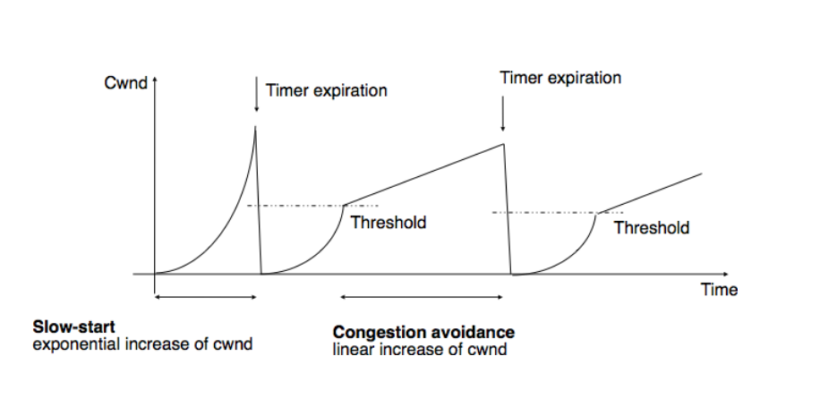
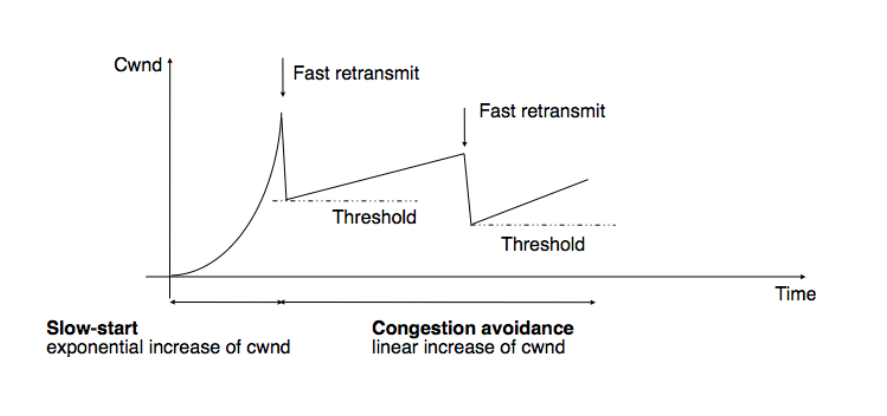
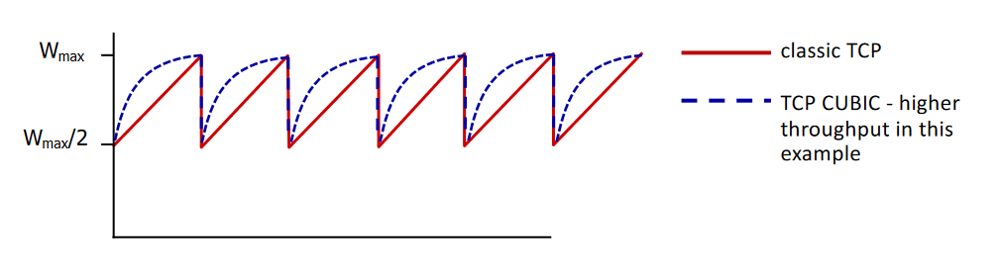
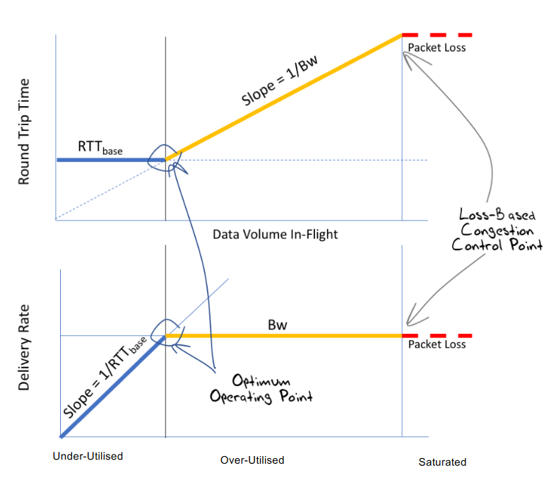
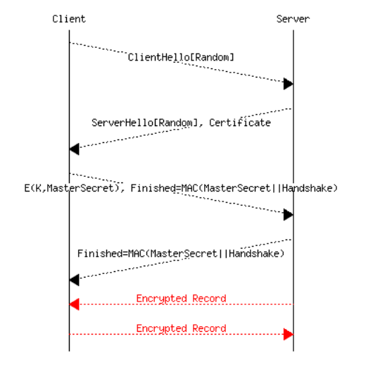
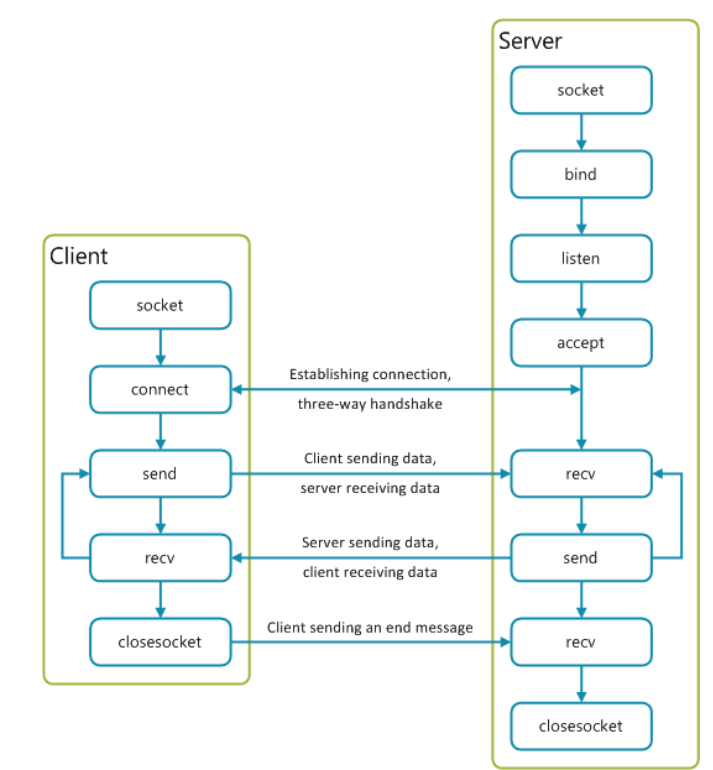
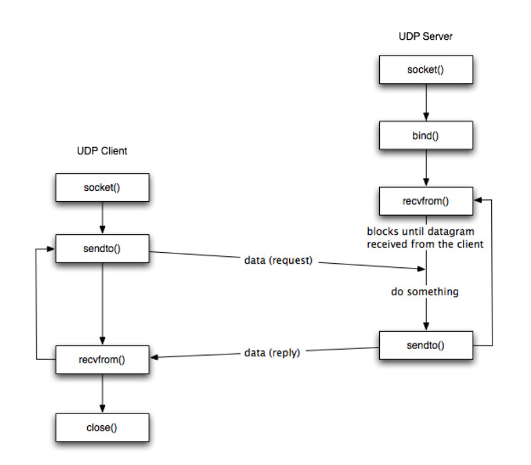

# Transmission Control Protocol

Author: **LBO** 🥖

Sources:
  - [Course on Moodle](https://moodle.insa-lyon.fr/course/view.php?id=5794)
  - [Wikipedia / TCP Congestion Control](https://en.wikipedia.org/wiki/TCP_congestion_control)
  - [Wikipedia / Algorithme TCP](https://fr.wikipedia.org/wiki/Algorithme_TCP)
  - [Rick Astley](https://www.youtube.com/watch?v=dQw4w9WgXcQ)

_Every newly defined terms are written in __bold__._
_If a term is not __bold__, either it was defined previously or it's too obvious to be defined._

Before reading this course, note that TCP was invented in a weird context, i.e. the cold war.
We were afraid that the Russians might destroy part of the network.
Hence, TCP was created such that it's able to work while part of the network is down.
The principle allowing this is the __end-to-end principle__, which is a part of the net neutrality law.

> The end-to-end principle states that all the work and computations should be done at each ends of a communication.
> This way, the network isn't aware of the content of the paquets going through it.
> Nowadays, this principle is out-to-date since our phones and other user equipments are likely to be less powerful than our operator's routers.

## Necessary vocabulary (don't skip)

In order to start this course on solid grounds, one should define some terms we'll be using.

With TCP, we send __segments__, not ~~packets~~ since _packet_ is for the IP.

The __MSS__ is the _Maximum Segment Size_, which is the second layer MTU equivalent for the forth layer on the OSI model.

The __flux control__ is control of the segment flux such that the emitters adapts its speed with respect to its receiver.

The __congestion control__ the control of the congestion defined to avoid network congestion without the human intervention.

The __Receiver Window__ (_rwdn_ or _awnd_ for __Advertised Window__) is the maximum amount of segments that the host can receive for each time slot.
It is used for __flux control__.

The __Congestion Window__ (_cwnd_) is the maximum amount of segments that the network can handle simultaneously.
It is used for __congestion control__.

A __sequence number__ (_SN_) is a number attributed for each TCP segment, to order them.
It increases by one at each sent segment.
To avoid identical starting sequence number (__ISN__, _Initial Sequence Number_), it's designed to start with a number depending on the clock time, the source and destination IP address and a random number, for security reasons.

> The ISN is sent in the SYN segment during the handshake.

The __Round Trip Time__ (_RTT_) is the time between the sending and receiving a segment.
This is used to know if a segment is _lost_ or __on-flight__ (somewhere in the channel during its transmission).

TCP is an acknowledged protocol.
An __ACK__ (_ACKnowledgment_) acknowledges a received segment.
An ACK can contains some data.
This is called __piggybacking__.

TCP defines the __flight size__ as the number of non-ACKed segments, supposing the lost or on-flight segments.
__This is no cwnd !__

## ACKed or not ACKed ?

We will talk a bit more about ACK in the future of this lesson but one needs to know that TCP only acknowledges the last continuous sequence number.

> __Example__
> 
> A TCP receiver receives the segments numbered 1, 2, 3, 5, 6 and 9.\
> Can you guess which sequence number it will ACK ?
>
> The receiver will ACK the segment numbered __3__.\
> Since it didn't received the segment numbered 4, it won't acknowledge the segments with a higher number.
> 
> Note for later : TCP will continue ACKing the SN 3 until it receives the SN 4.
> These are called __duplicated ACK__.
> Keep this in mind for the congestion control section !

The basic transmission principle states that a segment can only be transmitted if the sequence number is lower than the highest ACKed segment plus the minimum between the rwnd and the cwnd.
In more mathematical terms :

> Highest_SN_transmittable = Highest_SN_ACKed + min(rwnd, cwnd)

## From RTT to SRTT 🚀

The __SRTT__ (Smoothed RTT) is the estimation of the RTT.
This SRTT is estimated base on the previous estimated SRTT and the previous measured RTT and a factor _a_ :

`SRTT[k] = a * SRTT[k-1] + (1-a) * RTT[k-1]`

The factor _a_ is static and should be chosen regarding the channel stability :

- Unstable channel => big _a_
- Stable channel => small _a_

It's almost impossible to estimate it correctly.
Hence, two cases might occur :

- The SRTT is underestimated (SRTT < RTT), leading to unwanted retransmissions.
- The SRTT is overestimated (SRTT > RTT), leading to useless waiting times.

Overall, it's best to overestimate the SRTT to avoid network congestions.

## Congestion control 🚗🚘💥🚙💢

Before controlling the congestion, TCP needs to know when congestion occurs !
Remember that TCP was invented before the wireless communications, in a time were channels were pretty stables.
Hence, it considers that a lost segment implies congestion.
That's rude, I agree I agree I agree 🐺

Now the question _"When do I know that a segment was lost ?"_ raises.
Not receiving a ACK doesn't imply that the segment was lost.
Maybe the ACK is lost, or maybe the SRTT was badly estimated.
But still, default TCP waits for a timer based on the RTT before it considers a segment lost.
This process is bettered by a particular TCP extension, named __fast retransmit__ that we'll talk about later on.

## Slow start, congestion avoidance and TCP enhancements

When TCP initiate a connection, it starts its __slow start__ process.
This process consist in increasing the supposed cwnd exponentially until it reaches a threshold called __ssthresh__ (_slow start threshold_).

After the cwnd reaches this threshold, it continues incrementing the cwnd but one by one.
This moment is called __congestion avoidance__.

When a segment got lost, TCP adapts the ssthresh and resets the cwnd to start over the slow start.
At this moment :
`ssthresh = flight-size / 2` ; `cwnd = 1` and the slow start restarts.

Now, let's talk about the enhancements provided in TCP.

### Fast retransmit

This is a TCP enhancement created to better the retransmission method for the lost segments.

Remember duplicated ACKs from the ACK section ?
Fast retransmit considers that receiving __three__ identical duplicated ACK implies that a segment was lost, since the receiver didn't received it.
Thus, the lost segment is retransmitted, of course.

> Considering a segment lost after a single duplicated ACK is rude.
> Maybe the channel disordered the segments, creating duplicate ACKs even when no segment is lost.
>
> __Example__
>
> A receiver receives the segments 1, 2, 3, 5, 4.\
> It will ACK 1, 2, 3, 3, 5, creating a duplicated ACK when no segments are lost.
>
> Note that this implies that TCP receiver have a buffer to store disordered segments.

If you're curious and smart or maybe if you already know about TCP enhancements, you might ask yourself something like 
_"Duplicated ACKs implies that I start over the slow start process ?_
_Isn't rude if I'm able to receive the ACKs ?_
_The network should not be that congested ..."_
And you would be right !
Follow to the next section

### Fast recovery 🤕

__Fast recovery__ complements fast retransmit and considers that the network is not congested enough after three duplicate ACKs to start over the slow start process.
Instead, fast recovery restarts from the congestion avoidance state setting cwnd to `ssthresh + number of duplicate ACKs received (ndup)` instead of `1`.

Note that the ssthresh is still `ssthresh = flight-size / 2`

---

Let's compare TCP without the enhancements and TCP with fast retransmit and fast recovery.

Here's what the classic cwnd TCP looks like without the enhancements :

And here's how it's improved with the above enhancements :

The difference is clear !
The cwnd is higher is average with the enhancements.

## TCP options

The previous section was about the TCP enhancements.
This section is about TCP options.
The options are optional and should be supported by both ends to be used.

### Selective ACK

__Selective ACKs__ (_SACK_) is a TCP option negotiated during the connection handshake.
If set-up, the receiver won't create duplicated ACKs.
Instead, it will ACK the highest continuous SN, as default TCP does, but it will also include the received segments in the TCP header.
This way, the emitter can retransmit (through fast retransmit) only the missing segments.

### Delayed ACK

TCP can choose to delay ACK when the traffic is bidirectional, to use some piggybacking.
Meaning that TCP waits for the application layer to have some data to send before ACKing a segment, to implement this data in the ACK segment, to reduce the cost of the header.

Notwithstanding, one should send the ACKs after two consecutive segments received or if 500 ms elapsed, even if no data is to be sent.

## TCP Algorithms

Here, we'll cover a small list of the available TCP algorithms.
If they're so much TCP algorithms, it's to solve different problems such as delays, congestions, speed, etc.

The use of these algorithms might required a single end to support it, or both ends to support it and might require the routers to support it.
To know more, check the amazing table from Wikipedia [here](https://en.wikipedia.org/wiki/TCP_congestion_control#Algorithms) (no Rick roll, I promise).

### Nagle's algorithm

Do you know the SSH protocol ?
This application protocol creates a shell on a distant machine for you to manage it from a distance.
If you never heard of it, you will probably heard of it when you'll start working in a company.

Even if you already used SSH, you might not know how it works in details, and me neither.
Nonetheless, what's important to know is that every input you make on that shell sends data to the remote machine.
Meaning that it doesn't wait for you to press `Enter` to send data.
If, when you press `a` on your keyboard, it displayed a `a` on the shell, it's because the remote machine answered with a `a` to your input.

With that said, how could this be compatible with heavy headers for each ridiculous input ?

Here comes a new challenger : __Nagle's algorithm !__\
This algorithm solves the problem of the too small segments, such as the ones created by SSH.
This algorithm waits for the application layer to have more data to send before sending a segment.
A segment is sent when the buffer fills a full segment or if a segment was received and that the data can be sent through piggybacking.

This looks a bit similar to the delayed ACKs but be careful, the two interacts really badly together !
They were both created at the same period (around the 80s) by two different groups.
When implementing a TCP solution, one should always deactivate one of the two, risking a constant 500ms delay otherwise !

### TCP CUBIC

__TCP CUBIC__ is the default algorithm for TCP.
It considers that the network congestion is almost constant through time.

TCP CUBIC defines a new variable : __W_max__ which is the window size just before the last reduction, that we'll talk about now.

Here how the algorithm works ...\
If the congestion (cwnd) reaches W_max, one sets `cwnd = W_max / 2` and makes cwnd reach W_max super fast, leading to a cubic function.

### TCP BBR

__BBR__ stands for _Bottleneck Bandwidth and Round-trip propagation time_.

To talk about this algorithm, let's define how the network can be.
There's several possibilities :

- The network is under-utilized ;
- The network is over-utilized, meaning that at least one link is at its max capacity and one or more routers are buffering ;
- The network is saturated, meaning that at least one router has its buffer full and starts to drop segments.

The objective of the BBR algorithm is to find the optimal spot to use the network at its max capacity, between an under-utilized and a over-utilized network.
To know what's the actual state of the network, TCP BBR probes the RTT at regular intervals.

Here's how it works ...
- If the RTT is contant, the network is under-utilized, so increase the transmission rate.
- If the RTT increases, the network is over-utilized, so pace the transmission rate.

Here's the targeted point for the TCP BBR :

## How to break the end-to-end principle ⛓️

Respecting the end-to-end principe is nice and all but as you can expect, it's not that optimal.
One wants that the expensive operator's routers do at least a part of the job.
That's why comes __network-assisted solutions__, beyond the end-to-end principe !

In the next sections, we'll talk about some of these network-assisted solutions to enhance TCP to an other level 🚀

### Random Early Detection

__Random Early Detection__ (_RED_) happens at the router level and manages IP packets queues, by dropping some when the amount of IP packets in the queue reaches a certain threshold.

_Note that not every IP packets are dropped, only few depending on a certain probability._

This behavior will affect the TCP senders that will decrease its cwnd and go back to slow-start or congestion-avoidance state, reducing the network usage before the congestion !

> Also note that this process is an IP-level process.
> We don't talk segments, but packets.
> Thus, this is a cross-layer mechanism, not very OSI friendly !

### Explicit Congestion Notification

__Explicit Congestion Notification__ (_ECN_) works in a similar way as RED with a queue and a threshold.
Instead of dropping IP packets, it marks them by changing two bits in the Type-Of-Service section of the IP header.

TCP then inspect the IP header and is able to know that a router queued too much packets and that the congestion is near.
Thus, the TCP sender can reduces its cwnd to prevent the future congestion.

ECN avoids packets drops and reduces the delays due to retransmission so everyone's fine !\
_Every one except OSI_ 😢

## Where's security ? 🤫 Is it encrypted ?

No 😐.

Your reaction -> 😲 !

TCP does not implement any security at all.
Every messages we're discussing, it's all in clear.

When TCP was created, the bearded males rejected the problem on the above layer : the application layer.
This is not cool since it's against the scalability of applications development.
More and more people are developing applications.
Security should be there by default, for the sake of simplicity and security !

That's why other bearded male created __TLS__ (_Transport Layer Security_), which is an evolution of SSL (_Secure Socket Layer_).
TLS encrypt and decrypt the data exchanged through TCP.

> TLS and classic TCP coexist in the real world.
> They're usually on different ports : 80 for classic HTTP and 443 for HTTPS (with TLS).
> That's the little green lock you have on your browser when surfing the web.
>
> Nowadays, every website is secured through HTTPS.
> Your browser even warns you when this is not the case !

### TLS in practice

Here's the messages exchanged to build a secured TCP connection through TLS :

Let's see a bit in details the content of each of these messages ...

The __ClientHello__ message contains :
- The _protocol version_ ;
- A _random number_ to generate encryptions keys ;
- The _Cipher suites_ which is the list of supported cryptographic algorithms ;
- The _compression algorithms_, often disabled ;
- Some _extensions_ such as the __SNI__ (_Server Name Indication_)

The __ServerHello__ message contains :
- The answer to the _ClientHello_ ;
- A _random number_ to generate encryptions keys ;
- A _session ID_ to resume the session if needed

The __Certificate__ authenticates the server to the client.
It's based on a public key infrastructure that the client can check.
The certificates are distributed by __Root Certifications Authorities__ (_CA_).

A __MasterSecret__ is created on the client side with the server's public key with the selected cryptographic algorithm.
This MasterSecret is then sent to the server.

The server then answers with a __Finished__ message containing a __Message Authentication Code__ (_MAC_) and ensures the integrity of the messages.

This security solution works as well as excepted.
Notwithstanding, it's slow 😕

## How to code a client / server communication ? 👨‍💻

Everything we saw previously about TCP was already coded by people way smarter than you and me.
Still, one might need to start a TCP or UDP server on its own, for fun or sadomasochism.

We'll present here the simplest way to build a TCP or UDP client / server communication using widely used methods present in every respectable coding language, through the __Socket API__.

_Just a quic note for later ..._
_QUIC is not handled by the the Socket API._
_I know that this is foreshadowing and I hate to do so but I had too!_

The scheme are self-explanatory and you'll surely find a lot of example on the wide world web.

### TCP client / server

### UDP client / server

## When the biggest IT company faces daily problems

Nowadays, almost all the traffic is HTTP traffic, thus mounted on TCP.
A protocol that blocks future segment if a single one got lost (__Head OF Line blocking__, aka _HOL blocking_).
That is unwanted in the case of streams or loading web pages.

The traffic often goes through a single TCP socket for multiple streams which goes against the current policy of security through traffic filtering, for VPN, NATs, firewalls, etc.

And the Internet is growing old bones.
It's almost impossible to propose a new backward-compatible TCP versions and totally impossible to implement a new transport protocol at the OS level, at least for us little humans.
This is the __Internet ossification__.

These are common issues, and Google decided to take a leap of faith to solve them.
Probably not for charity but because it needed a solution !
And this answered is called __QUIC__ !

### QUIC, not QUICK 🍟

QUIC is a new transport layer developed by Google released in 2012 and made public in 2013.
QUIC workarounds the Internet ossification by implementing itself at the user level over UDP. 

QUIC integrates the classic TCP congestion control, with Selective ACKs.
But it does way more than that.

It integrates TLS in the TCP three-ways-handshake to reduce the connection delays.
The drawback it that it requires every TCP traffic to integrate TLS, even when not necessary.

QUIC defines a __connection ID__ instead of the TCP socket, allowing a user to switch its connection between IP addresses and network interfaces, which was impossible with the TCP socket bounded to an address and interface.
This also allows resuming a previous connection.

Even if every streams are going through a same connection, QUIC implements flow control to control each streams independently.
This also prevents HOL blocking.

QUIC also uses a single segment identifier, even for retransmissions, easing the RTT measurements.

When creating a new QUIC connection, many cases can occur :
- The server is known to the client and there was a previous QUIC and TLS session. In this case, __0-RTT__ (no round trip) are required to talk to the server !
- The TLS key can be reused but there was no QUIC session. Only __1-RTT__ (a single round trip) is required to establish the session.
- Worst-case scenario, everything should be setup, __2-RTT__ (two round trips) are required.
